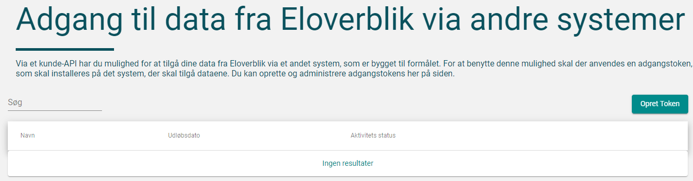
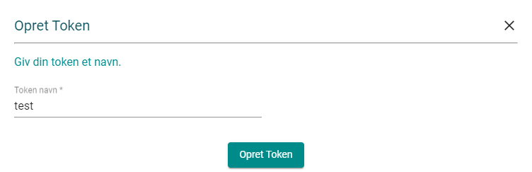
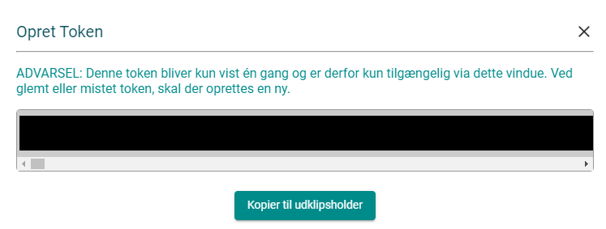

# Eloverblik


## Installation

I recommend to create a virtual environment where to install the package. In Linux

```source
python3 -m venv .venv
source .venv/bin/activate
pip install .
```

Next, set up the API key in [eloverblik](https://eloverblik.dk/), and save it in the main folder as `token.txt`. See below for a guide on how to do that. 

# Start the dashboard

In the activated virtual environment with `eloverblik` installed, type in the command line

```source
eloverblik dashboard
```

## Setting up the API key

Start by creating an empty `token.txt` file in the main directory of the cloned project.

Log on to [eloverblik](https://eloverblik.dk/) through MitId

Under your profile, clik **DATADELING**


and then **Opret Token**



Accept the terms, and give any name to the token, for example `test`.



Click on **Opret Token**. A pop-up window will now show your token. Click **Kopier til udklipsholder** to copy the code. **Note that you will not be able to copy the token again from this point onwards. Eventually repeat the process and create a new token**.



Finally, paste your API key in the `token.txt` file you have created at the earlier, save the file, and close it.

You're now good to go!
